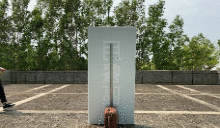
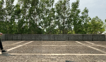

# Trapezoidal Bi-LSTM for Video Frame Inpainting
Jaden Chao-Ho Lin, Ting-Hui Chiang, and Yu-Chee Tseng, Department of Computer Science, National Chiao Tung University


|                **Original occluded video**                 |                   **Perspective video**                    |
| :--------------------------------------------------------: | :--------------------------------------------------------: |
|  |  |


## <!-- Citation -->

### Preparation

<!-- If you find this project useful, please cite our ACCV 2018 paper: -->

##### Setup the environment
In this section, we provide an instruction to help you set up the experiment environment. This code was tested for Python 2.7 on Ubuntu 16.04, and is based on Tensorflow 1.13.2


Use the following command to install all dependencies you need to run this model.

```shell
cd [To this project]
pip install -r ./requirements/requirements.txt
python requirements/imageio_download_ffmpeg.py 
```


## Download datasets

We use the KTH Actions, NCTU-Ped datasets to evaluate our method. Please download any of these datasets to start your training.

1. [KTH Actions](http://www.nada.kth.se/cvap/actions/)
2. [NCTU-Ped](https://drive.google.com/drive/folders/1rFG20waxb_Aqm5xAjqpaINfK3GxliD8h?usp=sharing)

Extract the dataset into `data` folder.

**Note: If you use other datasets, change the files in `videolist` to point to the correct video paths. Alternatively, you can create a symlink from `data` to your custom folder. You may find some tools in `pre-processing` that may help you with pre-processing.

## Train our model

### Training example (on KTH Actions)

Run the following command directly to start training:

```shell
python train_kth_trape_bi_jstlstm.py
```

*Note: NCTU-Ped uses different arguments, like resolutions, sequence length, input data paths...

Training takes a long time (our Trapezoidal Bi jstLSTM model took 3 days on a Nvidia GTX 1080 Ti GPU).

After training process is done, you will see the last 5 checkpoint of the model in `checkpoint` folder. It also outputs results every specific iterations in `results` folder.


### Visualize the training process

Losses and visualizations are saved in a TensorBoard file under `log` for each experiment. In order to view these results, you can activate a TensorBoard:

```bash
tensorboard --logdir=./log
```

You can view the trend chart while it is training or when the training is finished.


## Evaluate models

Before you start, make sure you have trained the model that you want to evaluate.

You can run the following command to evaluate a model:

```
python test_kth_trape_bi_jstlstm.py
```

You can modify the above python code to adopt on other datasets or models.


#### More details

This is what each argument specifies:

* train_data_paths: Specify the path of training  videolist file.
* valid_data_paths: Specify the path of testing  videolist file.
* save_dir: The path to save checkpoints.
* gen_frm_dir: The path to save results.
* log_dir: The path for TensorBoard.
* input_length: The number of former and latter frames.
* seq_length: The number of total frames.
* img_height: Input image height.
* img_width: Input image width.
* img_channel: Number of image channel.
* num_hidden: The number of convolution filters.
*  lr: Learning rate.
* batch_size: Batch size of one iteration.
* max_iterations: Maximum of iterations.
* delta: Specify the probability of lost frames that increase with each iteration

